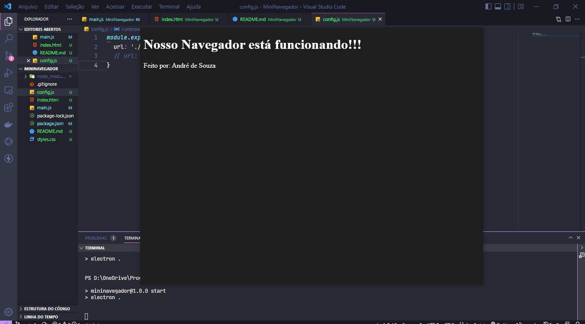

## Mini Navegador com Electron

Mac => Cmd+J = inspecionar elemento.
Windows => Ctrl+Shift+I inspecionar elemento.

Clique na tela para arrastar.

* Se precisar mudar o tamanho mude a propriedade resizable: true no main.js
* Se quiser usar no seu localhost, vá no arquivo config.js e mude para localhost

----Quem sabe no futuro podemos levar este projeto adiante.

